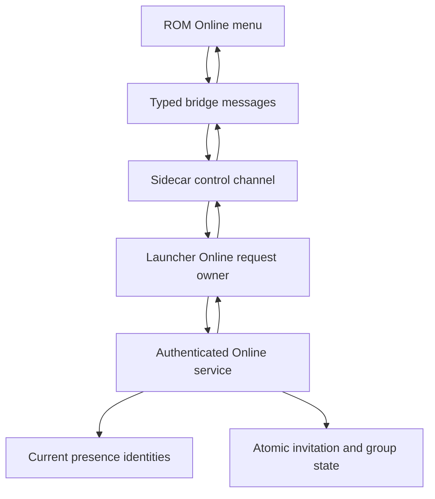
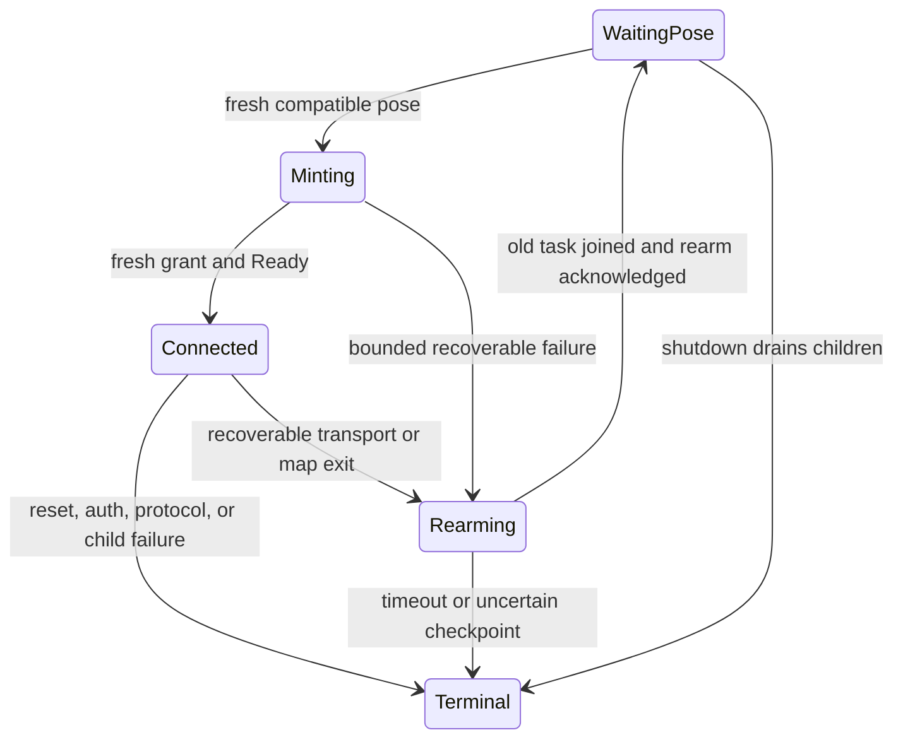
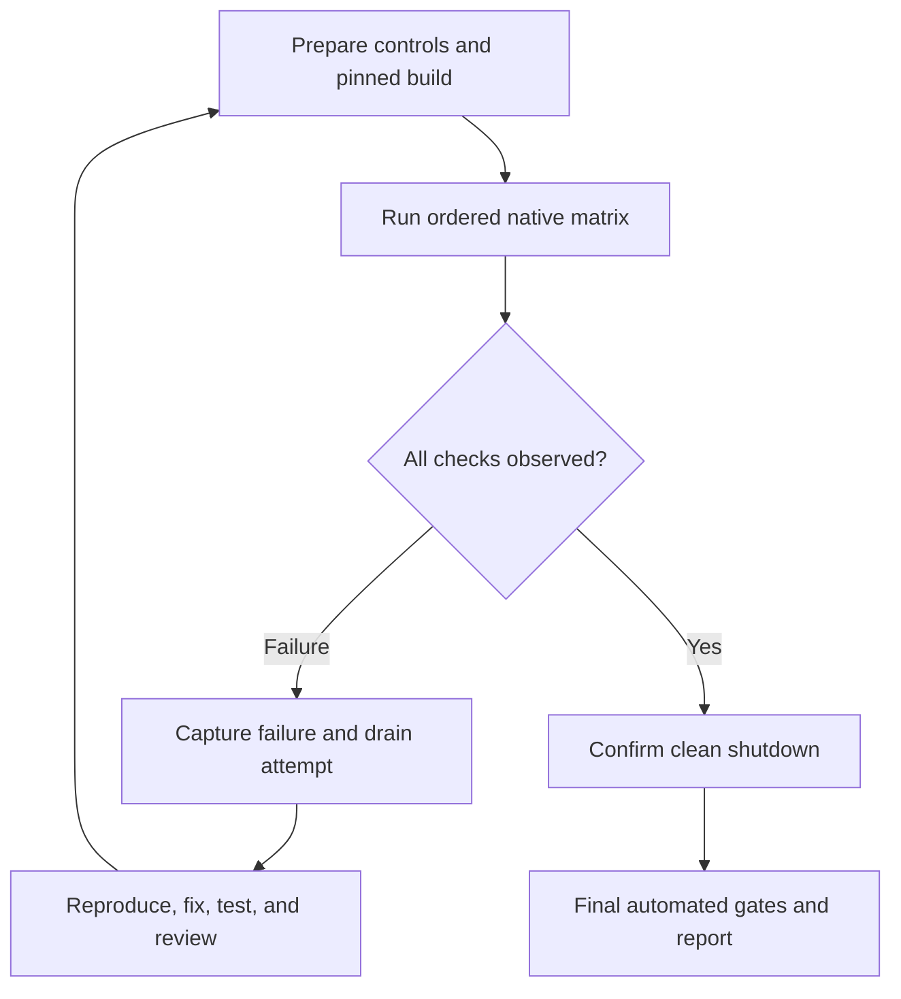

# Online invitations and presence reconnection

Execution update (2026-09-07): the expanded Character/Online native matrix passed
on the final build, including both lifecycle cleanups (4221.48 seconds). See
[final evidence](../testing/evidence/character-20260906/final-campaign/README.md)
and [Final Validation](../testing/littleroot-conformance.md#final-validation).
Native late-response overlap was not claimed; the specified deterministic
reopened-view fallback covers ordering. Formal ce-code-review was unavailable;
manual diff scanning and separate scoped reviews are recorded explicitly.

## Goal Capsule

Players can form and leave a two-person group from the game and recover nearby presence after a connection interruption.
Use the existing authenticated group service and an Online pause menu, with fresh transport ownership on reconnect (KTD1–KTD4).
The user authorized implementation after recording testing lessons; those lessons are now in `docs/solutions/workflow-issues/stock-mgba-testing.md`.
The initiative invariants remain authoritative. Work and commits stay local; no remote publication, deployment, or account messaging.
The implementing agent owns integration, verification, review, and local delivery. Stop dependent work for contradictory product requirements or uncertain save recovery.

---

## Product Contract

### Summary and problem frame

Two stock emulators now show reciprocal movement, but players cannot access the existing group service from the game and a dropped presence transport terminates their session.
This milestone exposes those social actions and lets an otherwise healthy gameplay session recover presence.
It implements the next slice in `docs/product/roadmap.md`, preserving the broader initiative in `docs/plans/pokecrossroads-cloud-coop/initiative-requirements.md` without rewriting its unrelated milestones.

### Requirements

**Online menu**

- R1. The normal pause menu provides Online with visible loading, unavailable, and operation-result states and a working Back action.
- R2. A player can select a currently eligible nearby player and send an invitation; the recipient can inspect, accept, or decline a pending invitation.
- R3. Either group member can leave. Both players subsequently see ungrouped status; leaving retains ordinary nearby avatars, the emulator, and the character lease.
- R4. The server owns authorization, identities, invitation expiry, two-member symmetry, and atomic membership changes. Stale selections and duplicate submissions cannot target a different player or apply an operation twice.

**Recovery**

- R5. A transport interruption or departure from the supported presence map clears old remote avatars and keeps gameplay, heartbeat, and shutdown available. Presence can rejoin with a fresh ticket after returning to a compatible pose under the still-valid lease.
- R6. Unsolicited ROM reset, failed authorization/lease fencing, child failure, protocol corruption, and uncertain save recovery remain terminal. Recovery never fabricates or rotates a lease epoch locally.
- R7. Checkpoint reconciliation remains bounded and noncancellable; reconnect waits for its safe completion. Save revision changes alone do not replace a healthy transport.

### Acceptance examples

- AE1. Two players are in Littleroot. The inviter opens Online and selects the recipient while the recipient remains in the overworld. After the invitation is sent, the recipient opens Online, accepts it, and both can inspect group membership. Either can leave and both become ungrouped while nearby avatars remain.
- AE2. Declining or waiting past an invitation's expiry cannot later create a group through a stale menu action.
- AE3. A dropped transport is replaced only after the old coordinator is joined and a new acknowledged presence generation has a fresh pose. Reciprocal movement resumes.
- AE4. A player enters a house and returns to Littleroot; presence reappears without restarting the emulator. Unsolicited ROM reset still fails closed.

### Scope boundaries and assumptions

Reconnect here means presence transport recovery with a valid lease, not recovery of an expired lease or a reset ROM.
Presence remains limited to the existing Littleroot partition; this adds no live group warp, battle, production storage adapter, save/resume certification, or public hosting.
Online targets are bounded by the existing nearby presence capacity. A hidden menu observer may select a fresh visible overworld peer in the same partition; this does not relax facing-avatar interaction rules. Hidden or busy peers are not invitation candidates, including a peer who already has Online open. A received invitation remains discoverable when its recipient opens Online; accepting it revalidates the invitation and membership rules rather than requiring the sender to remain a visible invitation candidate.
The UI may page nearby players and incoming invitations to fit the GBA screen. Server UUIDs and credentials remain outside the ROM.

---

## Planning Contract

### Key technical decisions

- KTD1. Add authenticated bounded Online snapshot/action contracts beside the existing group APIs. Resolve opaque presence handles server-side and reuse group transaction rules under the existing runtime transition lock. Governs R2–R4.
- KTD2. Use correlated fixed-size Online request/status bridge messages and typed sidecar control records. The launcher owns the selected snapshot and maps menu choices to exact server identities; responses from superseded requests cannot replace current menu state. Governs R1–R4.
- KTD3. Reconnect creates a new single-use coordinator and fresh ticket under the existing valid runtime fence. Join the old coordinator first. An explicit authenticated rearm command uses the existing same-epoch SESSION_READY / ROM_READY handshake to clear ROM presence, with a correlated acknowledgement that advances the control generation and discards cached poses and queued lifecycle records. Unsolicited ROM_READY remains fatal. Governs R5–R7.
- KTD4. Keep Online network work bounded and asynchronous relative to heartbeat, checkpoint, and shutdown. Defer rearm while a checkpoint is unresolved and reject stale operation responses across fence changes. Governs R4–R7.

The one-attempt restriction in the older phase5 activation contract is superseded only for recoverable transport/map transitions described here. The reset latch, single-use sidecar driver, output generation fences, and checkpoint ownership rules remain in force.
The server already permits replacement presence connections under the same valid fence and gives replacements fresh opaque handles; no lease-epoch cutover is necessary.

### High-level technical design

### Implementation-time unknowns

Exact menu window layout, compact status codec offsets, and helper names are implementation decisions. Freeze and test shared byte layouts before dependent units begin.
Use existing local API, control, and presence patterns; no new framework or external dependency is needed.

---

## Implementation Units

### U1. Authenticated Online operations

**Goal:** Expose bounded nearby/incoming/group views and safe invite, accept, decline, leave operations.
**Requirements:** R2–R4, AE1–AE2, KTD1.
**Dependencies:** None.
**Files:** `coop/crates/coop-cloud/src/online.rs`, cloud exports, `coop/crates/coop-server/src/phase2.rs`, `phase2/online.rs`, `phase2/presence.rs`, `phase2/group_travel.rs`, `phase2/storage.rs`, and server Online integration tests.
**Approach:** Reuse authentication, lease validation, runtime lock order, transaction rollback, idempotency, and group membership indexes. Revalidate the selected handle at mutation time.
**Patterns to follow:** Existing group travel contracts and `phase2_group_travel` tests.
**Test scenarios:** Hidden menu source with fresh eligible target; stale/replaced/cross-partition target rejection; foreign invitation denial; expiry; accept/decline race; idempotent leave removes both indexes; existing runtime transition rules remain serialized. Battle ownership is deferred and this unit does not introduce a battle lock.
**Verification:** Strict contract decoding and authenticated real-server integration tests pass.

### U2. Typed Online bridge and acknowledged presence rearm

**Goal:** Carry menu requests/results and establish a fresh presence generation safely.
**Requirements:** R1, R4–R7, KTD2–KTD4.
**Dependencies:** None; bounded bridge records are independent of the HTTP contracts. Byte contracts are frozen here before U3 and U4.
**Files:** Protocol Online codecs, sidecar control/server, launcher process control pump, C bridge declarations and `src/coop/net_bridge.c`, corresponding protocol/sidecar/pump/ROM tests.
**Approach:** Add explicit bounded records. Distinguish requested rearm acknowledgement from unsolicited reset; advance and clear generation atomically before accepting fresh poses. Preserve strict old-epoch and old-generation rejection.
Keep the same-epoch ROM transmit sequence monotonic through SESSION_READY. Process sequence-1/boot-epoch ROM reset detection before expected-ack matching, even while rearm is pending. With exactly one finite pending authenticated rearm command, accept only a strictly newer same-epoch ROM_READY than its captured ROM sequence watermark; reject stale or mismatched acknowledgements. Correlate the resulting control acknowledgement to that command before advancing the launcher generation. No unsolicited ROM_READY becomes an expected acknowledgement merely because a rearm is pending.
**Patterns to follow:** Checkpoint command correlation and existing lifecycle writer admission.
**Test scenarios:** Valid codecs; malformed length/reserved bytes; stale request; wrong rearm correlation/epoch; rearm during checkpoint; queued old lifecycle at cutover; timeout; unsolicited reset remains fatal.
**Verification:** Cross-language codec fixtures and focused sidecar/control-pump tests pass.

### U3. Online pause menu

**Goal:** Make invitation and group actions usable on the GBA screen.
**Requirements:** R1–R4, AE1–AE2, KTD2.
**Dependencies:** U2.
**Files:** `src/start_menu.c`, `src/coop/online.c`, `include/coop/online.h`, ROM Online tests.
**Approach:** Use existing task/window/input conventions, fixed storage, bounded paging, and an explicit pending action state. Verify menu capacity with all optional unlocks rather than merely increasing its array. Preserve readable text with no clipping or overlap on the 240×160 screen; use bounded scrolling if all unlocked entries do not fit at the existing font height, and observe that full-unlock case in the native emulator.
**Patterns to follow:** Existing start-menu and save-dialog callbacks.
**Test scenarios:** All-unlocked menu fits; Back from loading/error; empty nearby/inbox; peer removed before Invite; pending/expired/accepted/declined/left views; duplicate A presses; stale response ignored.
**Verification:** Focused ARM tests and native emulator menu observations pass.

### U4. Launcher Online orchestration and reconnect

**Goal:** Wire real Online requests and recoverable presence into the lifecycle.
**Requirements:** R2–R7, AE1–AE4, KTD1–KTD4.
**Dependencies:** U1, U2.
**Files:** Launcher cloud adapter, `session.rs`, `realtime.rs`, Online module and launcher HTTP/lifecycle tests; narrow sidecar realtime outcome classification if needed.
**Approach:** Own one bounded Online operation and one coordinator at a time. Preserve heartbeat/checkpoint/shutdown arbitration. Classify recoverable socket/map transitions separately from protocol/fence failures; use bounded retry/backoff and fresh grants after acknowledged rearm.
**Patterns to follow:** Existing mint arbitration and noncancellable checkpoint loop.
**Test scenarios:** Real HTTP invitation chain; lost response idempotency; shutdown during Online request; socket replacement order; house-return; stale generation; protocol failure never retries; checkpoint overlap; no leaked tasks or leases.
**Verification:** Launcher integration/lifecycle tests prove the real cross-layer chain.

### U5. Integrated verification and player evidence

**Goal:** Verify the delivered flows and record their practical limits.
**Requirements:** All requirements and acceptance examples.
**Dependencies:** U1–U4.
**Files:** Manual stock mGBA harness, testing procedure/evidence, roadmap, regenerated distribution manifest.
**Approach:** Build corrected ROM, regenerate manifest before server compilation, run focused and workspace gates, then observe both games through the new flows. Apply the documented testing lessons. Remove abandoned helpers and experimental code.
**Test scenarios:** AE1–AE4, both directions, clean shutdown after recovery, and explicit failed/aborted-run handling.
**Verification:** Native screenshots plus real server/harness results support each claimed flow; independent review finds no unresolved correctness issues.

### U5 execution campaign: test, fix, and retest together

This expands U5 without changing R1–R7 or AE1–AE4. Run one coordinated local campaign through final evidence and cleanup. A campaign can contain several emulator attempts: a product change requires draining the current attempt, rebuilding, and testing the replacement artifacts. Do not promise that an unchanged pair of emulator processes can survive every fix.

**Character selection fixture (extended by the user's subsequent request).** Add an in-game Character menu using existing walking sprites. Select Wally for player one and Leaf for player two through that menu; verify each local sprite and the other player's remote sprite, movement, cancellation, roster cycling, and house return. The tagged saved appearance choice must preserve trainer identity, story progress, and specialized bike/surf/fishing graphics. The launcher still receives one character identity from login (`coop/crates/coop-launcher/src/auth.rs`); account rosters are outside this appearance feature.

**Preparation and testability.** Before launching the final observation attempt:

1. Reconcile any previous harness attempt and record its actual exit and cleanup result. Preserve failed-run evidence and private saves; never interpret an interrupted attempt as accepted.
2. Finish targeted automated checks and review fixes. Build the ROM, regenerate `dist/bridge_manifest.json`, then compile the launcher/server against that manifest. Record revision, local diff, and ROM/emulator hashes. Do not rebuild a running Windows executable.
3. Extend the existing local observation proxy in `coop/crates/coop-launcher/tests/real_mgba_presence.rs` with narrowly scoped, bounded Online-response delay and service-unavailable controls. Delay only the selected response so a later snapshot can proceed. They must leave heartbeat, checkpoint, and unrelated HTTP traffic working. Add harness tests proving route isolation, automatic release of delays, and cleanup on abort. These controls are test infrastructure; they do not change production timeouts or invitation expiry.
4. Keep the existing actual-WebSocket interruption control and its minimum two-disconnection acceptance guard. Give each attempt a fresh marker directory so controls and acceptance cannot leak from an earlier attempt.
5. Prepare normal-input navigation and screenshot labels before launch. Use the existing bounded observation duration, inspect each scene transition, and leave time for teardown. If the allotted attempt cannot finish, end it honestly and start another within the same campaign.

**Ordered native matrix.** Each row needs an observed outcome, an evidence reference, and the artifact hash in `docs/testing/littleroot-conformance.md`. Logs support screen observations; HTTP success alone cannot pass a player-visible check.

| Order | Scenario | Required result | Trace |
|---|---|---|---|
| 1 | Reach Littleroot, select Wally and Leaf in Character, cancel a changed preview, and move both players | Both authenticate; each sees the selected other avatar moving reciprocally; cancellation preserves the applied appearance | R5; character fixture |
| 2 | Open Online, inspect names and empty lists, Back, move, open Bag, then talk to an NPC/sign | Readable content and names; no blank screen, clipping, or corrupted restored dialogue | R1 |
| 3 | Send from player one while player two stays in the field; accept on player two | Both independently refresh and see the same group | R2–R4, AE1 |
| 4 | Leave as player one; form another group and leave as player two | Both independently become ungrouped after each leave; avatars and ordinary movement remain | R3, AE1 |
| 5 | Send and decline; attempt the stale accept. Send again and wait beyond the real invitation expiry before accepting | Neither declined nor expired invitation forms a group; refresh agrees on both players | R4, AE2 |
| 6 | Delay one Online snapshot, use Back while loading, reopen before releasing it, then release the old response and Refresh; separately inject Online HTTP 503 and use Back | Gameplay remains usable; the newer view is not replaced by the old reply; Refresh recovers; unavailable text is visible and Back works | R1, R4 |
| 7 | Close both menus, interrupt both actual presence sockets, then move both players | Old avatars clear; fresh connections recover reciprocal movement under the existing leases | R5–R7, AE3 |
| 8 | Enter a house and return as each player, then move both again | Correct avatar presence recovers in both directions without emulator restart | R5, AE4 |
| 9 | Use the normal debug UI to unlock all configured pause entries; scroll and wrap, select Online, and exit | Every entry is reachable without clipping; Online and restored field/menu graphics remain usable | R1 |
| 10 | End the attempt through the harness | Both lifecycles drain, leases release, children exit, and injected faults are removed | R5–R7 |

For row 3, prepare the recipient navigation before sending, allow snapshot completion before Accept, and inspect the result. The invitation lifetime is 30 seconds; navigation must not accidentally turn the acceptance case into the expiry case. Record the expiry case separately. Debug unlocks in row 9 are a layout fixture, not evidence of earned story progress. Indoor Ready with empty lists is not evidence of Unavailable.

For row 6, the launcher owns one pending Online operation: reopening while it is held can return Unavailable rather than a second successful snapshot. Release the held response before the existing five-second operation timeout to exercise the late-reply case. If ordinary native inputs cannot reliably establish this overlap, prove stale-response ordering in a deterministic launcher regression and record that boundary explicitly; native Loading/Back, HTTP 503/Back, and subsequent recovery still require observation.

**Failure loop.** On failure, capture the screen, relevant redacted log, exact action, expected result, actual result, and artifact hash. Identify the owning layer and reproduce the smallest failing case before changing it. Add a focused regression where it can detect the defect independently, apply the smallest fix, and rerun that check. A UI rendering fix also requires native observation. Review behavior changes independently, then drain and rebuild before any affected native retest. Never reload the live bridge or patch RAM, poses, saves, or acceptance to advance the scenario.

**Final gates and evidence.** Keep terminal reset, authorization, checkpoint-race, malformed-protocol, stale-generation, retry-parking, and pagination boundary cases in the automated suites; do not deliberately destroy the healthy native attempt to duplicate them. After emulator cleanup, run Rust workspace tests, formatting, Clippy with warnings denied, protocol/manifest checks, the Lua suites, and applicable Cloud Coop ARM tests. Record contention-related timing failures and rerun the unchanged failing case in isolation before diagnosing a logic bug. Fix actual regressions rather than extending deadlines to obtain green output.

All native rows must pass on the final product build; earlier screenshots remain historical evidence. Harness acceptance assertions must match the expanded matrix, including character appearance and fault-state observations. Write acceptance only after its gameplay assertions have been observed; final campaign success additionally requires actual clean teardown and final automated gates. A timeout, partial matrix, failed cleanup, or unresolved defect produces an incomplete result with precise remaining checks. Update the existing testing procedure, testing lessons, and roadmap, then deliver reviewed local commits. No remote publication is included.

---

## Verification Contract

Use existing Rust formatting and Clippy with warnings denied, focused cloud/server/sidecar/launcher tests followed by the workspace suite, protocol generator checks, Lua suites, a linked modern ROM build, and focused Cloud Coop ARM tests.
Record pre-change failing proof for behavior-bearing seams where practical; use native observation for menu layout and actual reciprocal gameplay.
Manual acceptance must be written only after each assertion is observed; timeout, abort, early child exit, or uncertain cleanup is never a pass.

---

## Definition of Done

R1–R7 are implemented and AE1–AE4 have evidence. Relevant automated checks pass, the native menu is usable, and both player lifecycles drain cleanly after recovery.
The testing documentation distinguishes proven flows from remaining milestones. Shared contracts agree across C, Lua, and Rust; stale generations cannot write into a replacement.
Independent code review is complete, abandoned-attempt code is removed, and the local changes are delivered without remote mutations.
