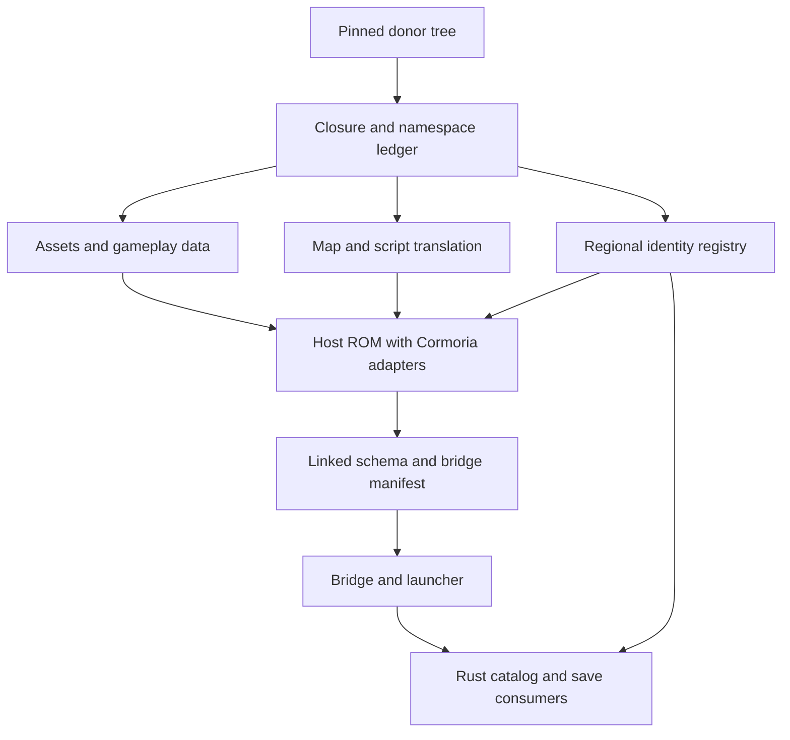
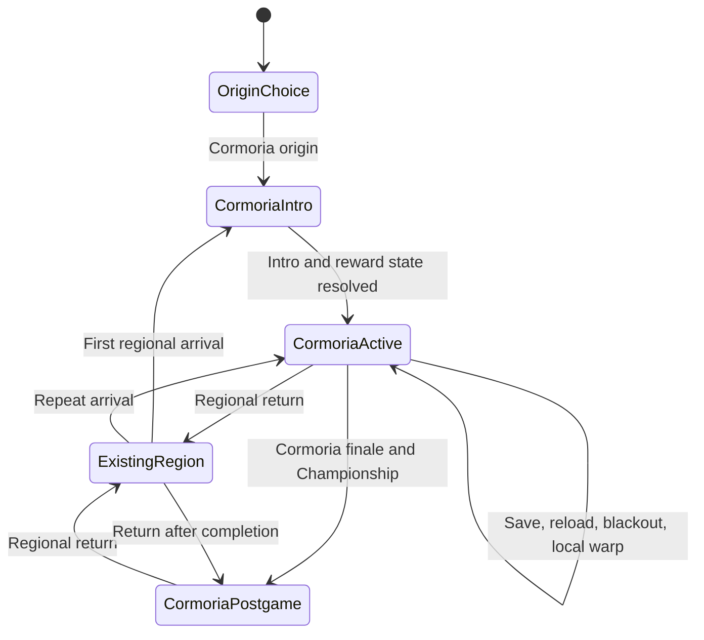

# Cormoria Region - Plan

> **Superseded by the user's multi-ROM direction.** Entering Cormoria must automatically switch to its ROM; leaving must switch back. Pokémon, inventory and co-op continuity remain required on every trip. Legacy saves need not migrate. The combined-ROM implementation units below are historical and must not be executed without revision. The donor inventory is complete, but campaign import and runtime adapters remain open. The active plan is [Cormoria travel between two ROMs](2026-09-22-cormoria-two-roms.md). Automatic switching has not yet been implemented or verified.

## Goal Capsule

- **Objective:** Players can complete the whole Cormoria adventure inside Hoenn Sessions and travel between it and the existing regions, alone or with other players present.
- **Means:** A pinned, namespaced content import with host runtime adapters (KTD1), widened logical map sections (KTD2), and coordinated save/co-op contracts (KTD3).
- **Authority:** User scope and explicit new-save permission govern the Product Contract. Requirements govern behavior; KTDs govern implementation within those requirements; units govern neither.
- **Execution profile:** Work in the isolated `codex/dreamstone-region` checkout based on `ea4bbc060b74b6418ac3fcaa0008cd62b1f83dce`. The implementing lead integrates the units, obtains independent review, and produces verified local artifacts.
- **Stop conditions:** An unresolved dependency, memory overflow, corrupt current-format save, conflicting identity, or failed required runtime case prevents completion. Preserve evidence and resolve the cause without dropping campaign scope.
- **Delivery boundary:** No remote publication, merge, deployment, production-data mutation, Jira mutation, purchase, or PC-sleep scheduling is authorized by this plan.

---

## Product Contract

### Summary

Add Dreamstone Mysteries' full Cormoria campaign to the host multi-region game. Players can select it as a fresh-game origin or reach it through regional travel, retain their character across journeys, and complete its story independently while co-op presence and travel remain consistent.

### Problem Frame

The host currently has no Cormoria region, maps, travel destination, or co-op identity. Dreamstone's campaign depends on custom quest commands, saved state, minigames, scripts, and assets that a scenery-only import would omit.

### Requirements

**Campaign and world**

- R1. Import all 165 maps in the donor's first six campaign groups, with the exact transitive dependency closure required by their events, connections, scripts, encounters, assets, and native features.
- R2. Preserve the complete story, all eight gyms and badges, Team Somber, the finale, Championship rounds, Cormoria Hall of Fame, postgame, sidequests, and minigames.
- R3. Preserve Cormoria trainers, wild encounters, gifts, items, dialogue, graphics, tilesets, object animations, and audio through semantic host equivalents or namespaced ports.
- R4. Preserve the donor's no-HM regional experience and its source-backed progression gates while retaining host battle rules and mechanics outside Cormoria.

**Entry, persistence, and regional services**

- R5. Provide a Cormoria fresh-game origin and ordinary entry/return through existing regional travel to the starting town; travel preserves name, party, PC, inventory, money, and other-region progress.
- R6. Current-format saves preserve Cormoria quests, story, badges, one-time rewards, regional services, party/PC data, and exact met locations across save, reload, travel, and blackout.
- R7. Introductory events and starter/reward delivery handle a full party and full PC without losing a reward, duplicating one, or blocking continued play.
- R8. Cormoria map names, region map, landmarks, fly points, healing, escape, dynamic warps/layouts, and completion state resolve to the correct region.

**Co-op and delivery**

- R9. Co-op identities, map coordinates, presence, invitations, and travel agree across ROM, bridge, Rust clients, and server; players retain independent campaign/quest state.
- R10. Starting a new save format is permitted. Existing user save files remain untouched; converting older saves is outside this delivery.
- R11. Verify every required campaign gate and branch through executable ROM state/transition cases, including Cormoria Hall of Fame and postgame access. Add representative final-ROM gameplay observations and observed two-client travel/presence/save scenarios. Record automated, fixture-assisted, observed, and unavailable coverage separately; static checks and a successful link alone do not establish gameplay behavior. A complete fresh-character playthrough of every battle is not required.

### Key Decisions

- **Full campaign import.** The six campaign groups define the required world, and their dependencies determine the remaining import. Governs R1-R3.
- **New saves are acceptable.** The user explicitly said, "New saves are fine." Governs R6, R10.
- **Host mechanics remain authoritative.** Donor content receives adapters at its integration boundaries. Governs R3, R4, R9.

### Actors and Key Flows

- A1. A new player choosing Cormoria as the first campaign.
- A2. A player arriving from an existing region with an established party and inventory.
- A3. A second connected player at a different story checkpoint.
- F1. A1 selects Cormoria, completes the introduction, receives the starter, progresses through gyms and story, reaches the Championship and Hall of Fame, and enters postgame. Covers R2, R5-R8.
- F2. A2 travels to Cormoria, completes local events, saves/reloads or blacks out, and returns with character data and other-region progress preserved. Covers R5-R8.
- F3. A2 and A3 meet, separate, invite/decline/accept travel, disconnect/reconnect, and continue their own quests. Covers R9.

### Acceptance Examples

- AE1. **Covers R5, R7:** An arriving player with six party members and a full PC can leave the introductory reward conversation and return after freeing space; the eventual reward is granted once.
- AE2. **Covers R6, R8:** A captured or hatched Cormoria Pokemon moves through party, PC, save/reload, and regional travel with its exact location displayed correctly; the same checks preserve existing-region locations and special met-location meanings.
- AE3. **Covers R2, R6, R9:** One player completes the finale and Championship while a connected peer has not; only the first player's Cormoria completion state changes, and neither player's Hoenn completion changes.
- AE4. **Covers R8, R9:** A disconnect during group travel leaves each character at a valid committed origin or destination, releases travel locks, and allows safe retry without duplicating costs or rewards.
- AE5. **Covers R2, R6:** Each minigame can be entered, cancelled, failed, won, rewarded, and replayed under its donor rules; exit restores field input, graphics, music, and persistent state.

### Scope Boundaries

The donor is [Dreamstone Mysteries at `f7997186345885bfa23a170e5f573851fc034b9b`](https://github.com/dsmyst/dreamstone-mysteries/tree/f7997186345885bfa23a170e5f573851fc034b9b). Import the campaign and its dependency closure, not the donor repository's unrelated Emerald content or engine configuration. R10 excludes legacy-save migration. Rebalancing host battle mechanics, redesigning the campaign, and introducing shared story progression are outside scope.

---

## Planning Contract

### Key Technical Decisions

- KTD1. **Deterministic content package.** Add `tools/cormoria/` and `data/cormoria/` using the manifest, source-hash, symbol-ledger, and generated-output patterns in `tools/johto/`. Prefix donor symbols and directories with `Cormoria_` even when their current names do not collide. Import compiled `scripts.inc`; donor `.pory` remains review evidence, not a second build toolchain. Keep provenance and credits with imported assets. Reuse host storage for byte-identical assets with matching format and semantics; differing assets retain separate names. Implements R1-R3.
- KTD2. **Global logical sections with compact Pokemon storage.** Append the 51 Cormoria section records at IDs 250-300, with `MAPSEC_NONE` at 301. Make logical section/met-location APIs and `MapHeader.regionMapSectionId` use `u16`, relocating met-location sentinels to `0x3FFD`-`0x3FFF`. Store the low eight met-location bits in the existing Substruct3 field and the high six in audited `PokemonSubstruct0.unused_02`, preserving 80-byte boxed and 100-byte party Pokemon. Generate the 32-byte MapHeader layout with a two-byte section field and assert its offsets and padding. Audit all existing mapsec/metloc types, raw section references, getter/setter pointer widths, TV fillers, summary, hatch, friendship, and transfer consumers; do not widen typedefs blindly. This avoids local-section aliases in existing global lookups. The region-local header alternative would require contextual dispatch at every raw consumer and offers less value with R10. Implements R6, R8.
- KTD3. **Versioned save and regional identity contract.** Append `REGION_CORMORIA` to the engine enum, use map-header engine-region byte 3, and append wire `CORMORIA=5` without changing previous ordinals. Map-header bytes are their own stable contract: Hoenn is 0 and Cormoria is 3. Remove the expanded-engine-enum fallback from header decoding; the current `REGION_HOENN` ordinal is also 3 and must never make a Cormoria header mean Hoenn. Tests and tooling must construct headers with the stable header constants. Use co-op schema V2 with its fifth eight-byte regional progress record at `0x25C`, leaving the extension at 672 bytes, CRC at `0x29C`, and 56 reserved bytes. Extend the ROM descriptor to describe the new record explicitly and update every parser, registry version/digest, validation fixture, and bridge-manifest consumer together. Allocate named Cormoria local state for quests, intro, and native features in the current save layout, measuring slot/chunk capacity from the linked build. Reject incompatible older formats without overwriting user files. Implements R6, R9, R10.
- KTD4. **Explicit script semantics.** Reserve collision-free Cormoria flags, vars, trainers, heals, and co-op identities from an exhaustive ledger. Rewrite every compiled reference through that ledger. Allocate host-safe quest commands/macros with correct script-effect metadata: donor `0xE5`-`0xE7` conflict with host command ownership and cannot be copied. Translate every special/native call to a documented semantic binding or bounded namespaced port; unresolved calls and no-op stubs are failures. Implements R1-R4, R6.
- KTD5. **Regional lifecycle adapters.** Reuse the host's registered map-pair, travel, save, and field-service patterns. Cormoria initialization is idempotent and separate from host new-game reset. Quest and story state remain player-local; co-op exposes only the host's supported regional progress and travel contracts. Implement region-scoped no-HM gate predicates from donor behavior. Implements R4-R9.
- KTD6. **Buildable dependency order.** Prepare import transforms and assets before live registration; quest/native adapters precede the map/scripts that call them. Generate live maps, script includes, encounters, and identity catalog atomically when their dependencies resolve. Verification phases divide the work, never the shipped campaign. Implements R1, R2, R11.
- KTD7. **Measured capacity and runtime evidence.** Use the successful untouched-main build recorded in [the Cormoria baseline](../testing/cormoria/baseline.md), then measure every unit against 32 MiB ROM, 256 KiB EWRAM, and 32 KiB IWRAM. Main occupies 31,597,600 ROM bytes, leaving 1,956,832 bytes. Measure exact-byte deduplication, host-compatible compressed output, and incremental linked deltas before full live registration; the Cormoria delta is still unknown. Keep ROM, ELF, source revision, bridge manifest, toolchain, and observed evidence tied together. Optimize only demonstrated waste if capacity fails; a reduced region is not an acceptable fallback. Implements R1, R11.

### High-Level Technical Design

The content path and runtime boundaries follow KTD1, KTD3, KTD4, and KTD6:



Character lifecycle under KTD5:



The host group-travel protocol remains authoritative; the Cormoria routes join its existing prepare/commit/recovery lifecycle:

```mermaid
sequenceDiagram
    participant Player
    participant ROM
    participant Coordinator
    participant Peer
    Player->>ROM: Request Cormoria route
    ROM->>Coordinator: Prepare with canonical map and eligibility
    Coordinator->>Peer: Offer existing group-travel invitation
    Peer->>Coordinator: Accept or decline
    Coordinator->>ROM: Commit approved destination or abort
    ROM->>ROM: Apply valid regional arrival and seal state
    ROM->>Coordinator: Fresh destination presence
    Note over ROM,Coordinator: Disconnect follows host recovery; no partial destination is advertised
```

### Assumptions

- The default arrival uses Carabrue, the donor starting town, with a return interaction adapted into the existing travel framework. Exact placement follows its walkable map geometry and intro sequencing.
- Source assets and preserved credits provide the implementation provenance record. This local delivery introduces no separate publication or distribution step.
- Source-backed fixtures may stage campaign checkpoints for executable ROM cases. Each case exercises the production script or adapter transition and asserts its result; fixture setup alone is not behavioral evidence. Label fixture-assisted cases separately from normal-button gameplay observations, and never present memory/pose writes as normal gameplay.

### System-Wide Impact and Risks

KTD2 reaches every section consumer, not just Cormoria: generated headers, Pokemon accessors, map-name UI, region-map tables, field comparisons, and saved records require a single consistent width. The audit must distinguish logical values from intentionally packed bytes, with boundary regressions around 249/250/255/256/300/301 and each relocated sentinel.

KTD3 changes the ROM/Rust save contract and the source identity registry. Existing fixed capacities for trainers, events, fly points, and gyms must be checked against the full U1 ledger before allocating ordinals. A capacity failure is resolved explicitly across all consumers before dependent imports proceed. Golden C/R byte fixtures and a genuine emulator save guard against both sides repeating an incorrect layout assumption.

KTD4's largest behavioral risks are donor opcodes, shared Emerald scripts with different meanings, map-specific native modules, one-time rewards, and finale globals. The binding ledger records the intended effect and a proving test for each adapter. Campaign completion must not inherit an unqualified host game-clear flag.

The untouched-main build uses 31,597,600 of 33,554,432 ROM bytes, 243,352 of 262,144 EWRAM bytes, and 28,648 of 32,768 IWRAM bytes. The remaining budgets are 1,956,832, 18,792, and 4,120 bytes respectively; [the baseline](../testing/cormoria/baseline.md) records the source and artifact hashes. The padded ROM file size and historical Johto figures are not occupied-space measurements. The imported content must fit after measured deduplication and host-compatible compression; its actual delta remains unknown. Native minigames can also exhaust transient sprites, tasks, windows, or VRAM despite a passing linker; U6 and U12 verify entry/exit cleanup and repeated use.

### Sources and Research

- Host base: `ea4bbc060b74b6418ac3fcaa0008cd62b1f83dce`; donor: the pinned tree in Scope Boundaries.
- Import patterns: `tools/johto/region_manifest.py`, `tools/johto/import_world.py`, `tools/johto/content_symbols.py`, `tools/johto/content_scripts.py`, `tools/johto/import_trainers.py`, `tools/johto/import_wild.py`.
- Section and data contracts: `include/gametypes.h`, `include/global.fieldmap.h`, `include/pokemon.h`, `src/data/region_map/region_map_sections.json`, `tools/mapjson/mapjson.cpp`.
- Co-op contracts: `include/coop/save.h`, `src/coop/region.c`, `data/coop/regional_identities.json`, `tools/coop/generate_regional_catalog.py`, `coop/crates/coop-protocol/src/lib.rs`, `coop/crates/coop-save/src/lib.rs`.
- Donor behavior: [campaign map groups](https://github.com/dsmyst/dreamstone-mysteries/blob/f7997186345885bfa23a170e5f573851fc034b9b/data/maps/map_groups.json), [quest opcodes](https://github.com/dsmyst/dreamstone-mysteries/blob/f7997186345885bfa23a170e5f573851fc034b9b/data/script_cmd_table.inc), [quest runtime](https://github.com/dsmyst/dreamstone-mysteries/blob/f7997186345885bfa23a170e5f573851fc034b9b/src/quests.c), [README and credits context](https://github.com/dsmyst/dreamstone-mysteries/blob/f7997186345885bfa23a170e5f573851fc034b9b/README.md).
- Current runtime contracts: `tools/generate_bridge_manifest.py`, `coop/crates/coop-launcher/src/compat.rs`, `coop/crates/coop-launcher/src/process.rs`, and `coop/crates/coop-launcher/tests/real_mgba_presence.rs`. Historical observation lessons in `docs/solutions/workflow-issues/stock-mgba-testing.md` and `docs/testing/littleroot-conformance.md` remain useful, but their older emulator pin/manual-startup instructions do not override current source.

---

## Implementation Units

Paths marked new are planned additions. Shared registries have one integrating owner; parallel owners prepare their own modules and manifests without rewriting another owner's changes.

| Unit | Outcome | Primary paths | Depends on |
|---|---|---|---|
| U1 | Baseline, pinned closure, and allocation ledger | `tools/cormoria/`, `data/cormoria/` | None |
| U2 | Section and met-location representation | `include/gametypes.h`, `include/pokemon.h`, `tools/mapjson/` | U1 |
| U3 | Save and co-op identity foundation | `include/coop/`, `src/coop/`, `coop/crates/coop-save/` | U1, U2 |
| U4 | Assets and deterministic import transforms | `graphics/cormoria/`, `sound/`, `tools/cormoria/` | U1, U2 |
| U5 | Quest runtime and persistence | `src/cormoria/quests.c`, `src/scrcmd.c` | U2, U3 |
| U6 | Native features and minigames | `src/cormoria/`, `data/specials.inc` | U3, U4 |
| U7 | Trainers, wild encounters, and gifts | `tools/cormoria/`, `src/data/` | U1, U3, U4 |
| U8 | Complete live world and scripts | `data/maps/Cormoria_*/`, `data/event_scripts.s` | U4-U7 |
| U9 | Origin, travel, and regional services | `src/new_game.c`, `src/region_map.c`, `src/cormoria/` | U8 |
| U10 | Complete campaign and finale semantics | `data/maps/Cormoria_*/`, `src/cormoria/` | U9 |
| U11 | Two-client integration and recovery | `src/coop/`, `coop/crates/` | U9, U10 |
| U12 | Final acceptance and handoff | `docs/testing/cormoria/`, `dist/bridge_manifest.json` | U10, U11 |

### U1. Establish baseline and complete content closure

**Goal:** Make every import dependency and resource claim measurable. **Requirements:** R1-R3, R11. **Dependencies:** None.

**Owned files:** New `tools/cormoria/region_manifest.py`, `data/cormoria/region_manifest.json`, `data/cormoria/source_manifest.json`, `data/cormoria/symbol_ledger.json`, `tools/tests/test_cormoria_manifest.py`, and `docs/testing/cormoria/baseline.md`.

**Approach:**

1. Measure the untouched host build under KTD7 before integrating source changes.
2. Record the six donor groups as 28/32/40/31/30/4 maps and trace every referenced layout, asset, script, special, trainer, encounter, heal, and dynamic destination.
3. Allocate deterministic map pairs and symbol ranges under KTD1/KTD4, checking signed map-component limits and co-op bitset capacities. Resolve external edges such as `MAP_ROUTE117_POKEMON_DAY_CARE` semantically; do not redirect an edge solely to satisfy linkage.

**Patterns:** Johto manifest and inventory tooling; generated regional identity lock.

**Test scenarios:**

- Exact pinned inputs yield 165 campaign maps plus an explained dependency set and identical generated output on a second pass.
- A missing native call, dynamic destination, asset, or unallocated numeric reference fails with its owning map/script.
- Duplicate host/donor symbols and exhausted flag/var/trainer/identity ranges fail before mutation.

**Verification:** Baseline hashes and memory table are captured, the complete ledger resolves, and no content is silently excluded.

### U2. Widen sections and preserve packed Pokemon records

**Goal:** Represent every Cormoria section without truncation. **Requirements:** R6, R8, AE2. **Dependencies:** U1.

**Owned files:** `include/gametypes.h`, `include/global.fieldmap.h`, `include/pokemon.h`, `include/region_map.h`, `include/regions.h`, `src/pokemon.c`, `src/pokemon_summary_screen.c`, `src/egg_hatch.c`, `src/tv.c`, section consumers discovered by the width audit, `src/data/region_map/region_map_sections*`, `tools/mapjson/mapjson.cpp`, `test/johto/sections.c`; new `test/cormoria/sections.c`, `test/cormoria/met_locations.c`, `tools/tests/test_cormoria_map_headers.py`.

**Approach:** Implement KTD2 as one contract change, with explicit logical accessors and packed storage boundaries. Update generated section records and header output together. Replace the Johto test's old hardcoded `MAPSEC_NONE=250`, 253-255 sentinels, and byte-range loop with the new actual ranges. Add characterization coverage before changing existing-region consumers.

**Patterns:** Existing Pokemon encryption/checksum accessors and generated map-header layout.

**Test scenarios:**

- Covers AE2. Locations at 249, 250, 255, 256, and 300 survive creation, capture/hatch, PC transfer, encryption, save/reload, and summary rendering.
- Every relocated special met location retains its semantic meaning; `MAPSEC_NONE` and invalid values never alias a real map.
- Box/party sizes remain 80/100 bytes; generated MapHeader fields match C offsets and expected 32-byte size.
- Existing-region map names, friendship comparisons, TV content, and summary text retain their prior behavior.

**Verification:** All audited reads/writes have a deliberate width, boundary regressions pass, and the host ROM remains within KTD7 budgets.

### U3. Coordinate saves, wire identities, and registries

**Goal:** Make Cormoria a valid region across persistent and co-op contracts. **Requirements:** R6, R9, R10. **Dependencies:** U1, U2.

**Owned files:** `include/constants/regions.h`, `include/global.h`, `include/coop/{region,save,progress}.h`, `src/coop/{region,save,progress}.c`, `data/coop/regional_identities{,.lock}.json`, `tools/coop/generate_regional_identities.py`, `tools/coop/generate_regional_catalog.py`, `tools/generate_bridge_manifest.py`, `coop/crates/coop-protocol/src/`, `coop/crates/coop-save/src/`, affected bridge/launcher parsers; `test/coop/{region,save,progress}.c`, `tools/tests/test_generate_regional_identities.py`, `tools/tests/test_generate_regional_catalog.py`, `tools/tests/test_generate_bridge_manifest.py`, `coop/crates/coop-save/src/tests.rs`.

**Approach:** Apply KTD3, derive catalog ownership from the ledger, and make new-save initialization explicit. Add linked-layout assertions and genuine-save fixture handling; retain strict CRC, region, and registry validation. Regenerate the currently stale bridge manifest from the integrated ELF/ROM using the source-pinned emulator contract before rebuilding the sidecar or starting runtime checks.

**Patterns:** ROM save descriptor, generated catalog/registry, and Rust canonical-save decoder.

**Test scenarios:**

- `CORMORIA=5` round-trips while previous ordinals remain unchanged; unknown regions and cross-region map pairs fail.
- Header byte 0 resolves only to Hoenn and byte 3 only to Cormoria. A header with byte 3 and a Hoenn section fails normalization instead of being accepted through the engine-enum fallback; out-of-contract header bytes are rejected.
- A V2 save contains five independent regional records at the documented offsets and preserves host regional state.
- C and Rust decode the same golden bytes; malformed CRC, digest, region ordering, reserved bytes, or section values are rejected.
- An incompatible old save is reported without modifying its source file; new current-format saves load normally.

**Verification:** All consumers agree on linked layout, registry identity, and canonical save shape before content registration.

### U4. Import assets and prepare world transforms

**Goal:** Reproduce Cormoria's world resources through host generators. **Requirements:** R1, R3. **Dependencies:** U1, U2.

**Owned files:** New `tools/cormoria/import_world.py`, `tools/cormoria/import_assets.py`, `data/cormoria/assets.json`, `graphics/cormoria/`, namespaced audio and tileset resources; touched host graphics/tileset/audio registries; new `tools/tests/test_cormoria_assets.py`, `tools/tests/test_cormoria_world.py`, `test/cormoria/assets.c`.

**Approach:** Translate donor layouts into host schema, import all ledger-owned graphics/audio, and deduplicate only exact bytes under KTD1. Record source bytes, reused host assets, host-compatible compressed output, and incremental linked costs against KTD7 before U8 registers the full world. Prepare deterministic world transforms against fixtures; defer live map/script registration to U8 under KTD6.

**Patterns:** Johto scenery, object-graphics, region-assets, and region-map importers.

**Test scenarios:**

- Every referenced tileset, metatile, object graphic, animation, palette, and song resolves to its manifest owner.
- Host asset names with different donor bytes remain unchanged while Cormoria gets a distinct symbol.
- Layout dimensions, border metadata, and collision data survive transformation, including dynamic layouts.
- Reimporting produces no drift; unknown formats and missing source hashes fail explicitly.

**Verification:** Asset closure is complete, generated resources link, and their measured memory delta is recorded.

### U5. Port the quest runtime and saved state

**Goal:** Preserve donor quest semantics and usable quest menus. **Requirements:** R2, R6, R9. **Dependencies:** U2, U3.

**Owned files:** New `include/cormoria/quests.h`, `include/constants/cormoria_quests.h`, `src/cormoria/quests.c`, `src/data/cormoria/quests.h`; `asm/macros/event.inc`, `data/script_cmd_table.inc`, `src/scrcmd.c`, relevant script-effect metadata, `src/start_menu.c`, `include/global.h`, `src/new_game.c`; new `test/cormoria/quests.c`, `test/cormoria/quest_save.c`, `tools/tests/test_cormoria_quest_commands.py`.

**Approach:** Port the donor's 20 quest IDs, 30 subquest slots, state operations, text, filtering, and menu lifecycle behind KTD4's safe command allocation. Add reset/load ownership to KTD3 and keep peer campaign state separate under KTD5.

**Patterns:** Host script command metadata and menu/task lifecycle; donor quest behavior is the semantic reference.

**Test scenarios:**

- Every quest/subquest operation yields the donor state/query/name-buffer result, including inactive and completed entries.
- Opening and closing the quest menu pauses/resumes its script correctly and restores field input and graphics.
- States survive save/reload and travel, and a connected peer's state is unaffected.
- An ordinary quest hand-in with a full reward pocket or full party/PC neither consumes its prerequisite nor completes while losing the reward; retry after leaving/reloading grants it once under donor rules.
- Malformed quest indices or states are contained; existing `0xE5`-`0xE7` host behavior remains valid.

**Verification:** Translated command fixtures execute correctly and the usable menu retains its state after a genuine save.

### U6. Port native campaign features and minigames

**Goal:** Supply every native dependency used by the campaign. **Requirements:** R1-R3, R6, AE5. **Dependencies:** U3, U4.

**Owned files:** New `src/cormoria/`, `include/cormoria/`, and `src/data/cormoria/` modules for Gacha, Block Stacker, Flappy Bird, Mining, Storage Cutscene, and any further ledger-discovered native dependencies; `data/specials.inc`, necessary host adapter hooks; new `test/cormoria/native_features.c`, `test/cormoria/minigames.c`, `tools/tests/test_cormoria_special_bindings.py`.

**Approach:** Bind compatible camera, cable-car, save, and other host services semantically. Port donor-only feature closures into Cormoria-owned modules under KTD4, including assets, rewards, failure branches, and lifecycle cleanup.

**Patterns:** Existing field-special wrappers and task/sprite/window cleanup conventions.

**Test scenarios:**

- Covers AE5. Each venue exercises entry, cancel, failure, reward, and replay with the correct costs and one-time/repeat rules.
- Full bag, party, or PC at reward time preserves value and allows recovery without duplication.
- Storage Cutscene and cable-car/camera sequences restore control, location, graphics, and audio on every terminal branch.
- Repeated entry/exit and save/reload do not leak task, sprite, window, or persistent feature state.

**Verification:** Every special/native ledger entry has a real binding and an acceptance case; no placeholder handlers remain.

### U7. Translate trainers, encounters, and gifts

**Goal:** Preserve campaign battle and reward content within host mechanics. **Requirements:** R2-R4, R6, R7. **Dependencies:** U1, U3, U4.

**Owned files:** New `tools/cormoria/import_trainers.py`, `tools/cormoria/import_wild.py`, `tools/cormoria/import_gameplay_data.py`, `data/cormoria/gameplay_manifest.json`, namespaced trainer party sources and runtime tables in `src/data/`, Cormoria item/gift adapters; new `tools/tests/test_cormoria_gameplay_data.py`, `test/cormoria/trainers.c`, `test/cormoria/wild.c`, `test/cormoria/gifts.c`.

**Approach:** Generate from donor source data through host trainerproc and encounter formats. Resolve every species, form, move, ability, held item, trainer class, and battle asset explicitly. Keep map-indexed publication for U8 and preserve host combat behavior per R4.

**Patterns:** Johto trainer, wild, item, and gift import/runtime tests.

**Test scenarios:**

- Every campaign trainer and encounter entry has the expected roster, level, map, and stable identity after transformation.
- Unsupported donor gameplay constants fail with context rather than falling back to zero/default values.
- Gifts preserve their attributes and exact Cormoria met location; full capacity and replay preserve reward idempotency.
- Cormoria trainer defeat, capture, and rematch bookkeeping do not collide with an existing region.

**Verification:** Gameplay ledger coverage is exact, host generators accept the sources, and adapted battles/rewards pass runtime tests.

### U8. Register the full live world and translated scripts

**Goal:** Make all campaign maps traversable with executable events. **Requirements:** R1-R3, R6, R8. **Dependencies:** U4, U5, U6, U7.

**Owned files:** New `tools/cormoria/content_symbols.py`, `tools/cormoria/content_scripts.py`, `include/constants/cormoria_content.h`, `data/maps/Cormoria_*/`, Cormoria layouts, `data/cormoria/script_bindings.json`; `data/maps/map_groups.json`, `data/layouts/layouts.json`, `data/maps.s`, `data/map_events.s`, `data/event_scripts.s`, live trainer/wild registries, generated regional catalog; new `tools/tests/test_cormoria_scripts.py`, `test/cormoria/scenery.c`, `test/cormoria/scripts.c`, `test/cormoria/warps.c`.

**Approach:** Atomically publish the output prepared under KTD6. Translate labels, flags, vars, map/warp/layout/heal references, quest commands, and native calls using KTD4. Resolve common donor scripts by behavior, including the external daycare edge and `MAP_DYNAMIC` ownership.

**Patterns:** Host generated map registries and Johto script binding/scene checks.

**Test scenarios:**

- All 165 maps register once with unique canonical ownership and complete script/asset references.
- Every connection/warp leads to its intended map; dynamic warp and layout branches preserve destination and return semantics across reload.
- Imported script labels and flag/var IDs cannot alter incumbent-region events, and no donor opcode bytes bypass translation.
- Representative exterior, interior, cave, underwater, ship, and finale maps render, collide, play music, and run their entrance scripts correctly.

**Verification:** No unresolved symbol or unreviewed external edge remains, and the fully registered world links within budget.

### U9. Connect origin, travel, and regional services

**Goal:** Integrate Cormoria into ordinary player movement and recovery. **Requirements:** R4-R8, F1, F2, AE1, AE2. **Dependencies:** U8.

**Owned files:** `src/new_game.c`, origin-selection UI and scripts, `src/regions.c`, `src/region_map.c`, `src/field_region_map.c`, `src/heal_location.c`, `src/data/heal_locations.json`, `data/event_scripts.s`; new `src/cormoria/region.c`, `src/cormoria/field_moves.c`, Cormoria region-map/landmark/fly tables; new `test/cormoria/origin.c`, `test/cormoria/travel.c`, `test/cormoria/field_services.c`, `test/cormoria/field_moves.c`.

**Approach:** Implement KTD5 with distinct fresh-origin and returning-traveler paths. Register Carabrue arrival/return, healing, visited/fly points, map names, escape behavior, and no-HM predicates. Keep region selection independent of numeric map-group ranges.

**Test scenarios:**

- A fresh Cormoria game and an existing-region fresh game select the correct introduction and initial state.
- Covers AE1. First arrival with full party/full PC is recoverable, grants the starter once, and preserves the arriving character.
- Leaving and returning during the introduction and after a later checkpoint preserves pending steps and does not repeat initialization or gifts.
- Blackout, escape, fly, reload, and return travel land on valid unlocked destinations without changing another region's progress.
- Each donor traversal gate allows and denies the intended Cormoria cases; existing-region HM/field rules remain unchanged.
- A veteran visitor's incumbent badges, HM permissions, and field-capable Pokemon neither bypass Cormoria prerequisites nor become unintended requirements.

**Verification:** F1/F2 work through normal UI and field inputs, including repeated region switches and a saved return trip.

### U10. Close every campaign branch and the finale

**Goal:** Prove the imported world supports the full adventure. **Requirements:** R2-R8, F1, AE3. **Dependencies:** U9.

**Owned files:** Cormoria map scripts, `src/cormoria/` story/reward adapters, Cormoria completion hooks in Hall-of-Fame handling; new `data/cormoria/campaign_checks.json`, `test/cormoria/campaign.c`, `test/cormoria/finale.c`, `docs/testing/cormoria/campaign-cases.md`.

**Approach:** Trace donor progression by phase, assign a proving case to each story gate and optional branch, and correct semantic drift at its owning adapter. Separate Cormoria finale/Championship/Hall-of-Fame state from host globals under KTD5.

**Test scenarios:**

- All eight gym gates, battles, badges, rewards, and rematches follow the donor's order and persist once earned.
- Main quests and Team Somber branches progress through the ship, Uncharted Island, Ancient Cormoria, Victory Road, and every Championship round.
- Loss, blackout, cancellation, save/reload, and revisit at story boundaries remain recoverable without skipped or repeated rewards.
- Covers AE3. Cormoria Hall of Fame opens its postgame while host completion and a peer's independent story remain unchanged.
- Legends, sidequests, and all Phase6 game/casino venues remain accessible under the donor's actual conditions.

**Verification:** The campaign matrix accounts for every phase, gate, and side venue. Required state transitions have executable ROM cases with source-backed preconditions and expected outcomes; U12 adds representative final-ROM gameplay observations.

### U11. Verify co-op travel, presence, and checkpoint recovery

**Goal:** Make Cormoria work across the real two-player boundary. **Requirements:** R6, R9, F3, AE3, AE4. **Dependencies:** U9, U10.

**Owned files:** `include/coop/group_travel_protocol.h`, `src/coop/group_travel.c`, affected presence/identity adapters, `coop/crates/coop-protocol/src/group_travel.rs`, `coop/crates/coop-launcher/src/group_travel.rs`, `coop/crates/coop-server/src/phase2/`, bridge consumers; `test/coop/group_travel.c`, `test/coop/presence_runtime.c`, `coop/crates/coop-server/tests/phase2_group_travel.rs`, `coop/crates/coop-launcher/tests/real_mgba_presence.rs`.

**Approach:** Append Cormoria travel routes without changing existing route meanings. Exercise the generated catalog, regional progress, travel handshake, and checkpoint lifecycle together. Follow the observed-boundary discipline in the stock-mGBA learning.

**Test scenarios:**

- Two Cormoria players see reciprocal movement and correct map identity; different-region players are not incorrectly colocated.
- Players on the same map before/after a story layout or gate change retain their own collision, NPCs, and triggers; incompatible remote geometry has a safe defined rendering outcome.
- A travel offer received during a quest menu, minigame, or storage cutscene follows host admission/expiry rules and cannot force a warp or leave a stale prompt after field control returns.
- Group travel covers eligible acceptance, denial, decline, expiry, and different individual campaign gates without copying story state.
- Covers AE4. Disconnect before prepare, during commit, and after arrival yields valid recovery, fresh destination presence, and released locks.
- Saving before presence, while a peer is visible, and after reconnect preserves each player's state and successfully completes canonical checkpoint validation.
- Covers AE3. Peer presence and finale completion cannot mutate the other player's quest, badge, reward, or host-region state.

**Verification:** Focused protocol/ROM tests pass and the real two-client run records visible behavior, saves, teardown, and lease cleanup against matching final artifacts.

### U12. Complete acceptance and local handoff

**Goal:** Deliver the complete verified integration with reproducible evidence. **Requirements:** R1-R11. **Dependencies:** U10, U11.

**Owned files:** `docs/testing/cormoria/acceptance.md`, `docs/testing/cormoria/campaign-cases.md`, a concise Cormoria entry/format guide, source/credits records, `dist/bridge_manifest.json`, and only implementation files required to resolve verified defects.

**Approach:** Complete R11 on a final linked build, rerun affected regression gates after any fix, and reconcile importer outputs and review findings. Record failed/aborted runs separately from accepted runs. Keep private scripts, saves, credentials, and tickets out of versioned evidence.

**Test scenarios:**

- Executable ROM cases cover all badge gates, finale, Championship rounds, Cormoria Hall of Fame, and postgame access through their production script/adapter transitions. Representative final-ROM gameplay observations exercise fresh entry and selected later campaign situations; fixture-assisted setup is identified explicitly.
- Sidequests/minigames and acceptance examples have their required observed or focused branch evidence on the same artifact family.
- Existing-region origin, travel, save, Pokemon location, battle, and co-op regression scenarios still pass.
- Reimport/regeneration produces no unexplained diff, and a clean build/test run reproduces the recorded outcome.

**Verification:** The Definition of Done is met and an independent reviewer has no unresolved blocking finding. Record unavailable or unobserved checks explicitly and continue independent implementation and automated verification; no such check may be marked passed. Full content and executable campaign coverage remain required, while a complete fresh-character traversal is not a completion gate.

---

## Verification Contract

The current environment provides Ubuntu 24.04.3 through WSL2, GNU Make 4.3, ARM GCC 13.2.1, Windows Cargo, and the executable bundled headless ROM test runner. Current source pins Windows mGBA 0.11.0, build `0.11-9139-3a5bc2462`, with executable SHA-256 `743157a16a1cb478a2b45e6e20e9a482ea397c3820d7e8e27b1e048e85bd5546`. The installed 0.10.5 executable cannot satisfy that co-op contract. Use the exact source-pinned runtime, supervised startup with its private bridge script, and the supported desktop automation for observations. The old checked-in manifest must be regenerated; older conformance documentation is not the runtime-version authority. Use a native WSL filesystem for ROM builds and record the exact source tree copied there. Build and runtime evidence must refer to the same source revision/diff and hashes under KTD7.

| Gate | Applicable units | Required outcome |
|---|---|---|
| Raw ROM baseline and `make modern` | U1, then every unit | Linker ROM/EWRAM/IWRAM table, raw/padded size distinction, toolchain and source/ROM/ELF hashes captured; KTD7 limits respected |
| Cormoria importer tests in `tools/tests/test_cormoria_*.py` and relevant generator tests | U1-U9 | Determinism, exact closure, semantic mappings, collision/range rejection, and generated contract integrity |
| Focused ROM `make check` suites for Cormoria and `Cloud Coop` | U2-U11 | Behavioral and ABI assertions pass, including packed Pokemon records and save/travel failures |
| Existing Johto/host section, save, field, gift, and battle regressions | U2, U3, U7-U12 | Cross-cutting changes preserve incumbent behavior |
| Rust focused tests, then `cargo test --workspace --locked` in `coop/` | U3, U11, U12 | Protocol/save/catalog/travel consumers agree, including malformed inputs and recovery |
| Linked bridge manifest generation and checks | U3, U11, U12 | Manifest matches current ELF save layout and final ROM; sidecar rebuilt after manifest changes |
| `cargo build -p coop-sidecar --locked` and `cargo test -p coop-launcher --test real_mgba_presence --locked -- --ignored --nocapture` | U11, U12 | Source-pinned mGBA 0.11 two-client scenario starts through the supervisor, is observed, and is accepted only after its assertions and cleanup |
| Complete executable campaign coverage, representative gameplay observation, and independent review | U12 | R11 proven with evidence type recorded; no blocking review findings, abandoned code, unexplained generated drift, or unsupported completion claim |

For native runs, use disposable saves and the private scripts bound by the current supervised launcher. Verify the exact pinned executable and startup-script capability before the two-client run; do not substitute the older manual-loading workflow or write the harness acceptance file for an unobserved assertion. Keep normal-button input sequences bounded and inspect state between steps through supported desktop automation. A ROM save-success message, a healthy bridge queue, or an HTTP success does not alone prove canonical checkpoint success, visible presence, or completed travel.

The campaign evidence follows the actual six groups: MyMaps; Phase2; Phase3; Phase4; Phase5 through Championship/Hall of Fame; Phase6 and other postgame/side branches. Map every required gate and branch to executable ROM cases, including save/reload and local failure/retry behavior. Add screenshot/input evidence for representative observed situations and the required two-client cases, with their owning campaign-check IDs. Label checkpoint fixtures, automated transitions, normal-button observations, and any remaining coverage limits accurately.

---

## Definition of Done

- All R1-R11 requirements have linked verification evidence, and every U-ID has met its stated verification outcome.
- The pinned import contains the full 165-map campaign and exact explained dependency closure, with no unresolved references, semantic stubs, silent fallbacks, or omitted venues.
- Section/met-location and save/co-op ABI boundaries pass static layout assertions, cross-language fixtures, genuine-save checks, and existing-region regressions.
- The final ROM satisfies measured hardware budgets, loads and saves correctly, and passes the complete executable campaign coverage and representative gameplay/two-client scenarios required by R11. The evidence distinguishes fixture-assisted setup from observed normal gameplay and identifies any unverified runtime assertions.
- Independent review has resolved every blocking correctness, data-integrity, and contract finding; generated files and bridge artifacts match their sources.
- Credits, entry instructions, new-save requirements, and reproducible evidence are recorded. Remove abandoned implementation attempts, temporary debug warps/unlocks, obsolete adapters, and scratch artifacts from the deliverable.
- Delivery remains local within the Goal Capsule's authorization boundary.
